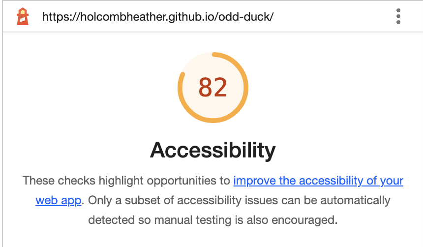

# Lab 11

## odd-duck
Web app to track votes for new product investment

### Author: Heather Holcomb | Code-201d98

### Links and References

- Heavily referenced document from class demo (https://github.com/codefellows/seattle-code-201d98/tree/main/class-11/demo)
- https://www.w3schools.com/jsref/met_element_addeventlistener.asp 
- https://developer.mozilla.org/en-US/docs/Web/API/EventTarget/addEventListener

### Lighthouse Accessiblity Report: 

 