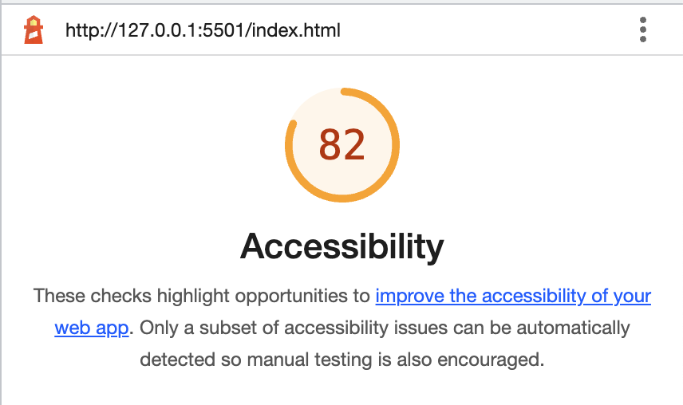

# Lab 11

## odd-duck
Web app to track votes for new product investment

### Author: Heather Holcomb | Code-201d98

### Links and References

Lab 11
- Heavily referenced document from class demo (https://github.com/codefellows/seattle-code-201d98/tree/main/class-11/demo)
- https://www.w3schools.com/jsref/met_element_addeventlistener.asp 
- https://developer.mozilla.org/en-US/docs/Web/API/EventTarget/addEventListener
- https://stackoverflow.com/questions/13831601/disabling-and-enabling-a-html-input-button 

Lab 12
- Class demo
- Array slice: https://developer.mozilla.org/en-US/docs/Web/JavaScript/Reference/Global_Objects/Array/slice 
- Slice: https://webtechparadise.com/article/understanding-slice-method-javascript-basics-negative-indexing-and-concept-shallow-copy/17
- Chart.js set up: https://www.chartjs.org/docs/latest/getting-started/
- Video on how to update bar chart for chart.js: https://www.google.com/search?q=using+.map+to+update+labels+in+chart.js&rlz=1C5CHFA_enUS952US952&oq=using+.map+to+update+labels+in+chart.js&aqs=chrome..69i57j0i546l4.26317j0j7&sourceid=chrome&ie=UTF-8#fpstate=ive&vld=cid:5fbca154,vid:Imo8XGqsAO4
- Bar chart example: https://www.chartjs.org/docs/latest/charts/bar.html 
- .map: https://developer.mozilla.org/en-US/docs/Web/JavaScript/Reference/Global_Objects/Map/size 
- For each: https://developer.mozilla.org/en-US/docs/Web/JavaScript/Reference/Global_Objects/Map/forEach 
- Map for name array: https://www.digitalocean.com/community/tutorials/understanding-map-and-set-objects-in-javascript 
- Data structures: https://www.chartjs.org/docs/latest/general/data-structures.html

### Lighthouse Accessiblity Report: 

Report for Lab 11:
 

Report for Lab 12:
